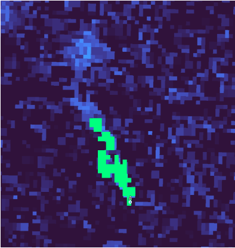

# Carbon Mapper - Version Log

Carbon Mapper is committed to continuously improving its scientific algorithms, applying updates to both future and historical data when necessary. This practice, known as “reprocessing,” is a widely used approach in scientific data management that ensures data remain accurate, consistent, and aligned with the latest scientific understanding, algorithms, and calibration standards. Reprocessing ensures consistency across data versions and sources by harmonizing datasets from different missions and instruments. This is crucial for creating seamless time series that support accurate analysis and monitoring of long-term trends.

All updates to Carbon Mapper data are assigned a version number for each product level, with a detailed version log summarizing modifications and documenting the state of the corresponding algorithms. Each version reflects rigorously vetted algorithm improvements to enhance accuracy and reduce observation uncertainty. Our [Algorithm Theoretical Basis Document (ATBD)](https://assets.carbonmapper.org/documents/L3_L4%20Algorithm%20Theoretical%20Basis%20Document_formatted_10-24-24.pdf) contains algorithm justification for our most recent algorithms and citations with detailed overviews of our product levels and algorithms associated with each product level. Additional information about each product level can be found in our [Product Guide]( https://carbonmapper.org/articles/product-guide).

We periodically reprocess historical data to ensure that past datasets benefit from the most recent, validated, and 
reliable algorithms. Previous versions of historical data will remain accessible to users who may need them for specific
applications or comparative purposes via [Carbon Mapper’s STAC API](https://api.carbonmapper.org/api/v1/stac). The STAC 
API can be used to retrieve previously published versions of data identified by the version number in the STAC collection name.Each historical reprocessing builds on the strengths of our existing algorithms, further 
enhancing data accuracy and refining precision to provide even more reliable emission estimates.

* The [Summary table](#summary-table) has an overview of published data versions.
* The [FAQ section](#version-log-faq) answers questions about how to use this version log and how to identify what version of a product you are looking at.
* The [Detailed Version Notes](#detailed-version-notes) thoroughly explain how algorithms changed in a specified collection and what instruments and gases are impacted.

# Summary Table

| **Version**       |                                                                  **High Level Notes**                                                                  | **Date Available** | **Processing SW**         |
|:------------------|:------------------------------------------------------------------------------------------------------------------------------------------------------:|:-------------------|:--------------------------|
| jpl               |                                                 Data processed by NASA JPL (Jet Propulsion Laboratory)                                                 | Aug 2016           | No version data available |
| [v0](#version0)   |                                                                Initial data algorithms                                                                 | March 2023         | No version data available |
| [v1](#version1)   |                                                    Heterogenous algorithm iterations across sensors                                                    | July 2023          | \> 0.4.0                  |
| [v2](#version2)   |                                                              Visualization products only                                                               | Jan 2024           | \> 0.21.0                 |
| [v3](#version3)   | Stable release to include more sensors/gases, retrievals incorporate more atmospheric information, updated masking and robust uncertainty calculations | Feb 2025           | \> 3.0.0                  |
| [v3a](#version3a) |                                               New Dynamic Noise Masking algorithm applied to L3 products                                               | Oct 2025           | \> 3.38.0                 |

**NOTE** Version 2 is guaranteed to include the changes listed under version 2 products. Version 1 may include incremental changes between v1 and v2. 

**NOTE** Versions that begin with j, were processed by NASA JPL using the same algorithms as the associated v<#> version.

**NOTE** Quantification products move straight from v1 to v3 (i.e., no v2 data exists for quantification products)

# Version Log FAQ


1. **How does Carbon Mapper use algorithms in its data?** <details><summary> (Click to expand)</summary>
    Carbon Mapper uses scientific algorithms to generate the methane and CO2 plume data that we make available on our data portal. These algorithms enable us to translate emissions detections from various remote sensing instruments (satellite or airborne tools) into the plumes that you see on our portal and the associated information associated with them (including the source emission rate).
    
    In short, these algorithms allow Carbon Mapper to turn the complex information delivered by observing instruments into actionable emissions data and insights.
    </details>

1. **Why do you conduct an update of your algorithms and reprocessing?** <details><summary>(Click to expand)</summary>

    Carbon Mapper continues to refine algorithms as more controlled release experiments are performed. Any modifications to Carbon Mapper algorithms from product levels 2 through 4 (L2–L4) are only undertaken when they significantly improve correlation and bias against controlled validation datasets and other independent benchmarks (e.g., cross-comparison with other instrument platforms).
    
    As Carbon Mapper acquires and quantifies more data across regions, sectors, topographies, surfaces, and environmental conditions, we continue to improve the science and algorithms behind our emissions data. Our ongoing validation work includes controlled release experiments, under-flights, and instrument and satellite inter-comparisons. Together, these efforts ensure all our data remain accurate, consistent, and scientifically robust — enabling users to confidently assess trends in data over time.
    
    Reprocessing Carbon Mapper’s historical data ensures that past datasets benefit from the most recent, validated, and reliable algorithms, further enhancing data accuracy and emission estimates. Reprocessing is a best practice in scientific data management that ensures data remains accurate, consistent, and aligned with the latest standards — enabling users to confidently assess trends in data over time.
    
    </details>

1. **Does reprocessing pertain to all data found on the Carbon Mapper portal, including Tanager data, as well as EMIT and airborne?** <details><summary>(Click to expand)</summary>
  Data reprocessing will focus on satellite data from Tanager and EMIT, and airborne data from AVIRIS-3 (AV3), all of which use similar, more globally applicable algorithms.
    </details>

1. **Are older versions of data considered less accurate than newer versions?** <details><summary>(Click to expand)</summary>
     We periodically reprocess historical data to ensure that past datasets benefit from the most recent, validated, and reliable algorithms. Each historical reprocessing builds on the strengths of our existing algorithms, further enhancing data accuracy and refining precision to provide even more reliable emission estimates.
    </details>

1. **How can I tell what version of data I am looking at?** <details><summary>(Click to expand)</summary>
    From the portal:
    
    
    From the STAC API (https://api.carbonmapper.org/api/v1/stac):
    * Find the version in the properties of each STAC item.  For example:
    
    ```
    {
      "type": "Feature",
      ...
      "properties": {
        ...
        "version": "v2"
      }
    }
    ```
    
    From CSV downloads
    ```
    plume_id,                      ...,  emission_version,  ...
    tan20250130t140224c00s4001-A,  ...,  v1,                ...
    ```
    </details>
 
1. **How do I know if algorithmic changes from one version to another impact the data I am looking at?** <details><summary> (Click to expand)</summary>
    Note the version number of your data and find the corresponding section in this Version Log.  Within this section, note changes described for data grouped by product level (eg, “L3”, “L4”), instrument (eg, “EMIT”, “Tanager”), gas, etc. to identify changes to your specific data.  If your data have no changes described for the given version, then they are not impacted.
    </details>

1. **What does the version mean?  Why would it change?**<details><summary>(Click to expand)</summary>

    Carbon Mapper works continuously to improve its algorithms for detecting and quantifying greenhouse gas emissions.  When an improvement is made and we begin using it to generate new data published on our portal, we will change the version number in the data to indicate that and to distinguish it from data generated with previous algorithms.
    </details>

1. **How much does reprocessing change the data and what kinds of changes are expected?** <details><summary> (Click to expand)</summary>
    These improvements represent a refinement of our processes and data, not a wholesale change. A majority of plumes are minorly changed, while a small minority are impacted due to the cumulative effect of several algorithm updates. We anticipate that less than 5% of plumes will be changed significantly (statistically relevant). Reprocessing is likely to result in a more accurate and robustly quantified emission rate that has been validated with controlled datasets and assessed against other independent benchmarks.
    
    Reprocessing allows plumes to be more accurately intercompared temporally and spatially. These algorithm refinements better account for detection and quantification elements such as geography, elevation, windspeed, and plume masking methodology. Some specific updates include the following:
    * We have adopted a consistent wind dataset for plumes outside the US. This dataset agrees closely with gold standard U.S. wind data products, allowing for accurate intercomparison of plumes globally.
      * Plume masking (separating plumes from backgrounds) is more sensitive to local plume conditions and provides more precision details.
      * Elevation and atmospheric conditions for each plume are now queried to more accurately quantify the amount of methane present.
    
    These elements provide more robust detail about each plume detection allowing us to better represent the specific uncertainties for each emission rate. 
    
    During reprocessing, all statistical outliers are manually re-assessed to ensure the newest algorithms are providing reasonable emission rates and behaving as expected. Minimal changes to plumes ensures accuracy while improving uncertainties and enabling more reliable intercomparisons — both temporally and spatially.
    
    </details>

1. **How frequently are new versions published?  Will I know in advance?** <details><summary>(Click to expand)</summary>
    In the interest of providing the best data we can, Carbon Mapper may begin publishing new versions of data at any time without prior notice.  When a new version is published, only new data will have the new version.  Prior (historical) data generated with a previous version will remain unchanged.
  
    Carbon Mapper will annually assess the need for, and if necessary, perform a historical data reprocess during the third quarter of each year. Such reprocessing will be announced in advance in this Version Log and other public communications.
  
    </details>

1. **Will “historical data” – prior to reprocessing – always be made available for comparison purposes? If so, how do I find a specific/fixed version of the data?** <details><summary>(Click to expand)</summary>

    Previous versions of historical data that have passed quality control checks will remain accessible to users who may need them for specific applications or comparative purposes.
    
    Carbon Mapper’s data portal (https://data.carbonmapper.org) always displays the most recent versions of the data.
    
    Carbon Mapper’s STAC API (https://api.carbonmapper.org/api/v1/stac) can be used to retrieve previously published versions of data identified by the version number in the STAC collection name.
    * See our [STAC Search tutorial](./tutorials/stac/search_l4a_ch4_emission.ipynb) for an example of using the STAC api.
      * See below for an example of modifying the above tutorial to search for V1 data: 
         * Modify the collection id to specify v1 (`"collections": "l4a-ch4-mfa-v1"` ) - the modified query parameters would look like:
    ```python
    
    parameters = {
        "max_items": 10,  # Limit results for tutorial
        "datetime": (
            datetime.strptime("20230101", "%Y%m%d"),  # Inclusive start
            datetime.strptime("20240101", "%Y%m%d"),  # Exclusive end
        ),
        "query": {"cm:emission": {"gt": 3000}},  # Emissions greater than 3000 kg/hr
        "collections": "l4a-ch4-mfa-v1",
    }
    search = catalog.search(**parameters)
    ```
    </details>

1. **Do you have case studies or examples of reprocessing changes?**<details><summary>(Click to expand)</summary>

    Several case studies showing differences between EMIT v1 to v3 plumes are included in the [Emit V3 Case Studies Section](#emit-case-studies-of-v3-changes) and outline the elements behind the various differences. 
    </details>

1. **Whom can I contact for more information about changes and versioning?** <details><summary>(Click to expand)</summary>
    Email Carbon Mapper at data@carbonmapper.org.
  </details>

# Detailed Version Notes
Refer to the ATBD for an in depth scientific justification of algorithms. The [L2B ATBD](https://assets.carbonmapper.org/documents/L2B%20Algorithm%20Theoretical%20Basis%20Document_formatted_10-24-25.pdf) includes details about filter types (MF/MFA/MFAL) and Unit Absorption Spectrum. The [L3/L4 ATBD](https://assets.carbonmapper.org/documents/L3_L4%20Algorithm%20Theoretical%20Basis%20Document_formatted_10-24-24.pdf) includes details about dynamic vs static retrievals, simple vs concentric circles IME, and maximum fetch)

**NOTE**: **<span style="color:red"> **bolded text** </span>** indicates changes to algorithms in current version

## Detailed Quantification Version Impact Table


<table>
  <thead>
    <tr>
    <th colspan="1" rowspan="2">Version</th>
    <th colspan="3">Product Levels Impacted</th>
    <th colspan="8">Instrument/Gas Impacted</th>
    <th colspan="1" rowspan="2">Date Available</th>
    </tr>
    <tr>
      <th>L2</th>
      <th>L3</th>
      <th>L4</th>
      <th >TAN CH4</th>
      <th>TAN C02</th>
      <th>EMIT CH4</th>
      <th>EMIT CO2</th>
      <th>AV3 CH4</th>
      <th>AV3 C02</th>
      <th>GAO/ANG CH4</th>
      <th>GAO/ANG CO2</th>
    </tr>
  </thead>
  <tbody>
    <tr>
      <td>jpl</td>
      <td><p>&#10003;</p></td>
      <td><p>&#10003;</p></td>
      <td><p>&#10003;</p></td>
      <td>N/A</td>
      <td>N/A</td>
      <td>N/A</td>
      <td>N/A</td>
      <td><p>&#10003;</p></td>
      <td><p>&#10003;</p></td>
      <td><p>&#10003;</p></td>
      <td><p>&#10003;</p></td>
      <td>Aug 2016</td>
    </tr>
    <tr>
      <td>V0</td>
      <td><p>&#10003;</p></td>
      <td><p>&#10003;</p></td>
      <td><p>&#10003;</p></td>
      <td>N/A</td>
      <td>N/A</td>
      <td><p>&#10003;</p></td>
      <td><p>&#10003;</p></td>
      <td>N/A</td>
      <td>N/A</td>
      <td><p>&#10003;</p></td>
      <td><p>&#10003;</p></td>
      <td>March 2023</td>
    </tr>
<tr>
      <td>V1</td>
      <td><p>&#10003;</p></td>
      <td><p>&#10003;</p></td>
      <td><p>&#10003;</p></td>
      <td>N/A</td>
      <td>N/A</td>
      <td><p>&#10003;</p></td>
      <td><p>&#10003;</p></td>
      <td><p>&#10003;</p></td>
      <td><p>&#10003;</p></td>
      <td><p>&#10003;</p></td>
      <td><p>&#10003;</p></td>
      <td>July 2023</td>
    </tr>
<tr>
      <td>V3</td>
      <td><p>&#10003;</p></td>
      <td><p>&#10003;</p></td>
      <td><p>&#10003;</p></td>
      <td><p>&#10003;</p></td>
      <td><p>&#10003;</p></td>
      <td><p>&#10003;</p></td>
      <td><p>&#10003;</p></td>
      <td><p>&#10003;</p></td>
      <td><p>&#10003;</p></td>
      <td> </td>
      <td> </td>
      <td>Feb 2025</td>
    </tr>
<tr>
      <td>V3a</td>
      <td> </td>
      <td><p>&#10003;</p></td>
      <td></td>
      <td><p>&#10003;</p></td>
      <td><p>&#10003;</p></td>
      <td><p>&#10003;</p></td>
      <td><p>&#10003;</p></td>
      <td><p>&#10003;</p></td>
      <td><p>&#10003;</p></td>
      <td> </td>
      <td><p>&#10003;</p></td>
      <td>Oct 2025</td>
    </tr>
  </tbody>
</table>


# Version 3a <a name="version3a"></a>

## Quantification Products

### TAN, EMIT
<details open><summary> CO2 </summary>
<details open>
  <summary>  L3a (collections: l3a-co2-mfal-v3a) </summary>

* Noise masking threshold: background + 1 * noise
* CMF is clipped to a smaller dataset, no_data values will be left as nans

</details>
</details>

<details open><summary> CH4 </summary>
<details open>
  <summary>  L3a (collections: l3a-ch4-mfa-v3a) </summary>

* Noise masking threshold: background + 2 * noise
* CMF is clipped to a smaller dataset, no_data values will be left as nans

</details>
</details>


### AV3
<details open><summary> CO2 </summary>
<details open>
  <summary>  L3a (collections: l3a-co2-mfal-v3a) </summary>

* Noise masking threshold: background + 1 * noise
* CMF is clipped to a smaller dataset, no_data values will be left as nans
* Quantified plume lengths (reported as fetch) are consistent with IME concentration mask length

</details>
</details>

<details open><summary> CH4 </summary>
<details open>
  <summary>  L3a (collections: l3a-ch4-mf-v3a) </summary>

* Noise masking threshold: background + 2 * noise
* CMF is clipped to a smaller dataset, no_data values will be left as nans
* Quantified plume lengths (reported as fetch) are consistent with IME concentration mask length

</details>
</details>

### ANG, GAO
<details open><summary> CO2 </summary>
<details open>
  <summary>  L3a (collections: l3a-co2-mfal-v3a) </summary>

* Noise masking threshold: background + 1 * noise
* CMF is clipped to a smaller dataset, no_data values will be left as nans
</details>
</details>


# Version 3 <a name="version3"></a>

## Quantification Products

### Tanager (TAN) 
**NOTE** TAN v3 data includes geolocation updates that were made by Planet due to calibration improvements - this 
results in some plumes shifting slightly in location compared to previous versions.

<details open><summary> CH4 </summary>

<details open>
  <summary> L2b (collection: l2b-ch4-mfa-v3) </summary>

* Wave length window
  * ****<span style="color:red"> (2100, 2430) </span>****
* Bad pixel saturation thresholds
  * 2092-2098nm range: Threshold of 3
  * ****<span style="color:red"> 2400-2500nm range: Threshold of 1 </span>****
* Unit Absorption Spectrum 
  * Solar Zenith Angle is queried
  * ****<span style="color:red"> Column Water Vapor is now queried </span>****
  * ****<span style="color:red"> Elevation is now queried </span>****
* Misc Changes
  * **<span style="color:red"> Bilinear resampling used to orthorectify retrieved concentrations (previously this was nearest neighbor) </span>**
</details>

<details open>
  <summary> L3a (collection: l3a-ch4-mfa-v3) </summary>

* Uses dynamic threshold masking 
  * **<span style="color:red"> Updated dynamic mask fit line </span>**
* Simple IME Method
  * Maximum Fetch is 2500m
  * **<span style="color:red"> Quantified plume lengths (reported as fetch) are consistent with IME concentration mask length </span>**
  * **<span style="color:red"> Include center pixel for IME and plume length quantification </span>**
</details>

<details open>
  <summary>  L4a (collection: l4a-ch4-mfa-v3) </summary>

* Wind products used
  * HRRR data archive for plumes within the HRRR coverage area 
  * ECMWF_IFS or ERA5 from OpenMeteo globally
* Emission Quantification Uncertainty
  * Uncertainty is propagated according to uncertainties in wind speed, IME, and plume length 
  * IME uncertainty includes retrieval, masking and length terms 

</details>
</details>

<details open><summary> CO2 </summary>
<details open>
  <summary> L2b (collection: l2b-co2-mfal-v3) </summary>

* Wave length window
  * **<span style="color:red"> (1960, 2430) </span>**
* Bad pixel saturation thresholds
  * 2092-2098nm range: Threshold of 3
  * **<span style="color:red"> 2400-2500nm range: Threshold of 1 </span>**
* Unit Absorption Spectrum 
  * Solar Zenith Angle is queried
  * **<span style="color:red"> Column Water Vapor is now queried </span>**
  * **<span style="color:red"> Elevation is now queried </span>**

</details>

<details open>
  <summary>  L3a (collection: l3a-co2-mfal-v3) </summary>

* Uses dynamic threshold masking 
  * **<span style="color:red"> Updated dynamic mask fit line </span>**
* Concentric Circles IME Method
  * Maximum Fetch is 2500m
  * **<span style="color:red"> Include center pixel for IME and plume length quantification </span>**
</details>

<details open>
  <summary>  L4a (collection: l4a-co2-mfal-v3)</summary>

* Wind products used
  * HRRR data archive for plumes within the HRRR coverage area 
  * ECMWF_IFS or ERA5 from OpenMeteo globally
* Emission Quantification Uncertainty
  * Uncertainty propagated according to uncertainties in wind speed and in the ratio of IME divided by plume length. IME/L is treated as a signal variable.
</details>
</details>

### EMIT 

<details open><summary> CH4 </summary> 
<details open>
  <summary> L2b (collection: l2b-ch4-mfa-v3) </summary>

* Wave length window
  * (2100, 2480)
* Bad pixel saturation thresholds
  * 2092-2098nm range: Threshold of 2
  * **<span style="color:red"> 2400-2500nm range: Threshold of 1 </span>**
* Unit Absorption Spectrum 
  * Solar Zenith Angle is queried
  * **<span style="color:red"> Column Water Vapor is now queried </span>**
  * **<span style="color:red"> Elevation is now queried </span>**
* Misc Changes
  * **<span style="color:red"> Uses correct geotransform from EMIT NetCDF metadata to eliminate small gaps between scenes </span>**
  * **<span style="color:red"> Projected to UTM to ensure consistency across instruments </span>**
</details>

<details open>
  <summary>  L3a (collection: l3a-ch4-mfa-v3) </summary>

* Uses dynamic threshold masking 
  * **<span style="color:red"> Updated dynamic mask fit line</span>**
* Simple IME Method
  * **<span style="color:red"> Maximum Fetch is 2500m</span>**
  * **<span style="color:red"> Quantified plume lengths (reported as fetch) are consistent with IME concentration mask length</span>**
  * **<span style="color:red"> Include center pixel for IME and plume length quantification</span>**
</details>

<details open>
  <summary>  L4a (collection: l4a-ch4-mfa-v3) </summary>

* Wind products used
  * HRRR data archive for plumes within the HRRR coverage area 
  * ECMWF_IFS or ERA5 from OpenMeteo globally
  * **<span style="color:red">  HRRR winds are spatially averaged to match the resolution of ECMWF_IFS allowing for cross comparisons of plume uncertainties regardless of detection location</span>**
* Emission Quantification Uncertainty
  * **<span style="color:red"> Uncertainty propagated according to uncertainties in wind speed, IME, and plume length </span>**
  * **<span style="color:red"> IME uncertainty includes retrieval, masking and length terms</span>**
</details>
</details>

<details open><summary> CO2 </summary>
<details open>
  <summary> L2b (collection: L2b-co2-mfal-v3) </summary>

**<span style="color:red"> This is a change from previously used mfa to mfal products </span>**

* Wave length windows
  * **<span style="color:red"> (1960, 2430) </span>**
* Bad pixel saturation thresholds
  * **<span style="color:red"> 2092-2098nm range: Threshold of 2</span>**
  * **<span style="color:red"> 2400-2500nm range: Threshold of 1</span>**
* Unit Absorption Spectrum 
  * Solar Zenith Angle is queried
  * **<span style="color:red"> Column Water Vapor is now queried</span>**
  * **<span style="color:red"> Elevation is now queried</span>**
* Misc Changes
  * **<span style="color:red"> Uses correct geotransform from EMIT NetCDF metadata to eliminate small gaps between scenes</span>**
  * **<span style="color:red"> Projected to UTM to ensure consistency across instruments</span>**
</details>

<details open>
  <summary>  L3a (collection: l3a-co2-mfal-v3) </summary>

* Uses dynamic threshold masking 
  * **<span style="color:red"> Updated dynamic mask fit line</span>**
* Concentric Circles IME Method
  * **<span style="color:red"> Maximum Fetch is 2500m</span>**
  * **<span style="color:red"> Include center pixel for IME and plume length quantification</span>**
</details>

<details open>
  <summary>  L4a (collection: l4a-co2-mfal-v3) </summary>

* Wind products used
  * HRRR data archive for plumes within the HRRR coverage area 
  * ECMWF_IFS or ERA5 from OpenMeteo globally
  * **<span style="color:red"> HRRR winds are spatially averaged to match the resolution of ECMWF_IFS allowing for cross comparisons of plume uncertainties regardless of detection location </span>**
* Emission Quantification Uncertainty
  * Uncertainty propagated according to uncertainties in wind speed and in the ratio of IME divided by plume length. IME/L is treated as a signal variable.
</details>
</details>

#### Emit Case Studies of V3 Changes

<details open><summary> Large Change (emi20240812t213903p14030-A) </summary>

Plume id: [emi20240812t213903p14030-A](https://data.carbonmapper.org/?details=CH4_1B2_250m_-101.91337_32.21234%3Fstatus%3Dnot_deleted#13.62/32.2185/-101.90175)

Change Notes: 
* Close to a 50% reduction in emission rate
* Change is due to the previous mask including an artifact (dark red pixels)
* We have improved our artifact masking on EMIT v3. This allowed us to remove those dark red false enhancements leading to a better mask and more accurate emission.

| **Version** |     **Emission** |                                                            **Concentration** |**Mask**|
|------------:|-----------------:|-----------------------------------------------------------------------------:|-------:|
|          v1 |11,155 ± 723 kg/hr |  |
|          v3 |6,085 ± 507 kg/hr |  |

</details>

<details open><summary> Small Change - Elevation (emi20240730t095231p07033-A) </summary>

Plume id: [emi20240730t095231p07033-A](https://data.carbonmapper.org/?details=CH4_1B2_250m_52.77433_43.29013%3Fstatus%3Dnot_deleted#13.12/43.30083/52.78972)

Change Notes: 
* Decreased 5.8%, this is within the previous uncertainties of this plume
* We have updated how we convert pixel concentrations into emission estimates. This now considers the elevation of the plume which led to a minor change in rate.
* Change is not perceptible to the eye. Do note that we have improved uncertainties so even though our rate changed very little this plume now has larger more accurate uncertainty bounds.

| **Version** |      **Emission** |                                                            **Concentration** |**Mask**|
|------------:|----------------------:|-----------------------------------------------------------------------------:|-------:|
|          v1 | 1690± 115 kg/hr |  |
|          v3 | 1592 ± 473 kg/hr |  |

</details>


<details open><summary> Small Change - Wind (emi20240816t104126p07026-A) </summary>

Plume id: [emi20240816t104126p07026-A](https://data.carbonmapper.org/?details=CH4_6A_500m_28.14771_41.21533%3Fstatus%3Dnot_deleted#13.12/41.21211/28.15728)


Change Notes: 
* Increased 12.6%, this is within the previous uncertainties of this plume
* Concentrations and masking have remained relatively consistent. Change is caused by winds increasing from 5.15m/s to 6.19m/s.
* We now use a consistent and thoroughly tested wind product for global emissions. This wind change is part of the updated uncertainties which again have increased to be more realistic for this plume. 


| **Version** |                      **Emission** |                                                                      **Concentration** |**Mask**|
|------------:|----------------------------------:|---------------------------------------------------------------------------------------:|-------:|
|          v1 |                 3,574 ± 487 kg/hr |  |
|          v3 |               4,024 ± 1,264 kg/hr |  |

</details>


### AVIRIS-3 (AV3) 
<details open><summary> CH4 </summary>
<details open>
  <summary>  L2b (collection: l2b-ch4-mfa-v3) </summary>

* Wave length window
  * (2100, 2480)
* Bad pixel saturation thresholds
  * 2092-2098nm range: Threshold of 2
  * 2400-2500nm range: Threshold of 1
* Unit Absorption Spectrum 
  * Solar Zenith Angle, Column Water Vapor, and Elevation are queried
</details>

<details open>
  <summary> L3a (collection: l3a-ch4-mfa-v3) </summary>

* Uses dynamic threshold masking 
* Simple IME Method
  * Maximum Fetch is 284m
</details>

<details open>
  <summary>  L4a (collection: l4a-ch4-mfa-v3) </summary>

* Wind products used
  * HRRR data archive for plumes within the HRRR coverage area 
  * ECMWF_IFS or ERA5 from OpenMeteo globally
* Emission Quantification Uncertainty
  * Uncertainty propagated according to uncertainties in wind speed, IME, and plume length 
  * IME uncertainty includes retrieval, masking and length terms
</details>
</details>

<details open><summary> CO2 </summary>
<details open>
  <summary>  L2b (collection: l2b-co2-mfal-v3) </summary>

* Wave length windows
  * (1860, 2190)
* Bad pixel saturation thresholds
  * 2092-2098nm range: Threshold of 2
  * 2400-2500nm range: Threshold of 1
* Unit Absorption Spectrum 
  * Solar Zenith Angle, Column Water Vapor, and Elevation are queried
</details>

<details open>
  <summary>  L3a (collection: l3a-co2-mfal-v3) </summary>

* Uses dynamic threshold masking 
* Concentric Circles IME Method
  * Maximum Fetch is 284m
</details>

<details open>
  <summary>  L4a (collection: l4a-co2-mfal-v3) </summary>

* Wind products used
  * HRRR data archive for plumes within the HRRR coverage area 
  * ECMWF_IFS or ERA5 from OpenMeteo globally
* Emission Quantification Uncertainty
  * Uncertainty propagated according to uncertainties in wind speed and in the ratio of IME divided by plume length. IME/L is treated as a signal variable.
</details>
</details>

### Global Airborne Observatory (GAO) & AVIRIS-NextGeneration (ANG) 
<details open><summary> CH4 </summary>
<details open>
  <summary>  L2b (collection: l2b-ch4-mf-v3) </summary>

* Wave length window
  * (2100, 2480)
* Bad pixel saturation thresholds
  * 2092-2098nm range: Threshold of 4
  * **<span style="color:red"> 2400-2500nm range: Threshold of 1 </span>**
* Misc Changes
  * **<span style="color:red"> Rotation has been removed and rasters are now oriented northward </span>**
</details>

<details open>
  <summary>  L3a (collection: l3a-ime-ch4-mf-v3) </summary>

* Uses static ppm-m threshold
  * 1000ppm-m
* Concentric Circles IME Method
  * Max Fetch 284m
  * **<span style="color:red"> Include center pixel for IME and plume length quantification </span>**
</details>

<details open>
  <summary>  L4a (collection: l4a-ch4-mf-v3) </summary>

* Wind products used
  * HRRR data archive for plumes within the HRRR coverage area 
  * ECMWF_IFS or ERA5 from OpenMeteo globally
  * **<span style="color:red"> HRRR winds are spatially averaged to match the resolution of ECMWF_IFS allowing for cross comparisons of plume uncertainties regardless of detection location </span>**
* Emission Quantification Uncertainty
  * Uncertainty propagated according to uncertainties in wind speed and in the ratio of IME divided by plume length. IME/L is treated as a signal variable.
</details>
</details>

<details open><summary> CO2 </summary>
<details open>
  <summary> L2b (collection: l2b-co2-mfal-v3) </summary>

**<span style="color:red"> This is a change from previously used mfa to mfal products </span>**

* Wave length windows
  * (1860, 2190)
* Bad pixel saturation thresholds
  * **<span style="color:red"> 2092-2098nm range: Threshold of 4 </span>**
  * **<span style="color:red"> 2400-2500nm range: Threshold of 1 </span>**
* Unit Absorption Spectrum 
  * Solar Zenith Angle is queried
  * **<span style="color:red"> Column Water Vapor is now queried </span>**
  * **<span style="color:red"> Elevation is now queried </span>**
* Misc Changes
  * **<span style="color:red"> Rotation has been removed and rasters are now oriented northward </span>**

</details>

<details open>
  <summary>  L3a (collection: l3a-co2-mfal-v3) </summary>

* Uses dynamic threshold masking 
  * **<span style="color:red"> Changed dynamic mask fit line </span>**
* Concentric Circles IME Method
  * Maximum Fetch is 284m
  * **<span style="color:red"> Include center pixel for IME and plume length quantification </span>**
</details>

<details open>
  <summary> L4a (collection: l4a-co2-mfal-v3) </summary>

* Wind products used
  * HRRR data archive for plumes within the HRRR coverage area 
  * ECMWF_IFS or ERA5 from OpenMeteo globally
  * **<span style="color:red"> HRRR winds are spatially averaged to match the resolution of ECMWF_IFS allowing for cross comparisons of plume uncertainties regardless of detection location</span>**
* Emission Quantification Uncertainty
  * Uncertainty propagated according to uncertainties in wind speed and in the ratio of IME divided by plume length. IME/L is treated as a signal variable.
 </details>
</details>

## Visualization Products
* No changes 

# Version 2 (Visualization Products Only) <a name="version2"></a>
<details open>
  <summary>  L2b (collection: l2b-rgb-v2) </summary>

* Implemented adaptive histogram stretching of radiance-based RGB
* Rotation has been removed from airborne products, and rasters are now oriented northward
* Uses correct geotransform from EMIT NetCDF metadata to eliminate small gaps between scenes
* Projected to UTM to ensure consistency across instruments
</details>

<details open>
  <summary>  L3a (collection: l3a-vis-ch4-mf-v2, l3a-vis-ch4-mf-v002) </summary>

* Increased minimum concentration for colormap
* Made concentrations use the same extent as plume visualization
* Replaced vector plume thresholding with Gaussian blur process
* Added median filtering to input CMF
* Removed extra nodata within the plume and reduced box buffer size
* Raises an exception if no plume is found during thresholding
* Raises an exception if CH4 plumes grow too large
* Estimated background and clip concentrations before thresholding
* Included more pixels near plume origin in cases where origin doesn’t touch enhanced pixels
* Added metadata to tags in plume GeoTIFF
* Updated default crop size for PNG images
* Fix PNG rotation bug
* Replace distance-based subsetting with pixel-based to allow for EMIT
</details>

#### Non-Quantification Supplemental Products:
<details open>
  <summary> L2b (collection: l2b-ch4-mfm-v2) </summary>

Only produced for airborne scenes
</details>

<details open>
  <summary>  L2b (collections: l2b-ch4-mfma-v2, l2b-co2-mfa-v2, l2b-co2-mfma-v2) </summary>
No Change
</details>


# Version 1 <a name="version1"></a>
## Quantification Products

All L2b, L3a, and L4a products in version 1 contain incremental changes that are fully documented and guaranteed to be included in version 3.


# Version 0 <a name="version0"></a>
## Quantification Products
### EMIT
<details open>
  <summary>  L3a (collection: l3a-ime-ch4-mfa-v1) </summary>

* The radii increase of each concentric circle IME calculation has been changed to a constant of 1 pixel. 
* Max fetch distances are strictly calculated instead of using the nearest convex hull point distance.
* The use of a set 150x150 pixel tile crop for small enhancements has been removed.
* The extra buffering has been removed to accurately report the maximum fetch used in the computation.
* The standard max fetch distance is now set to 2500m
* New EMIT IME uncertainty (2024-07-26)
</details>
